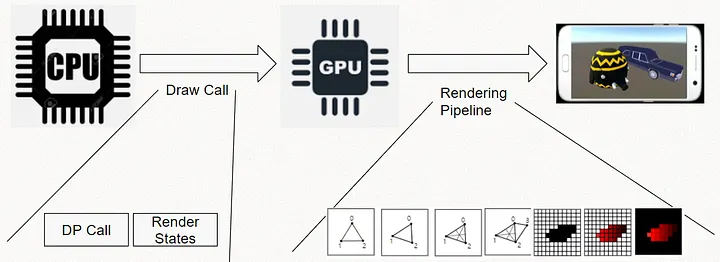
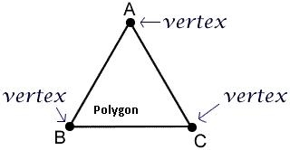
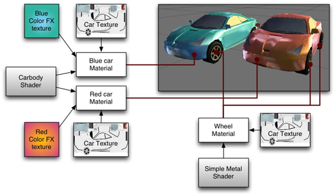
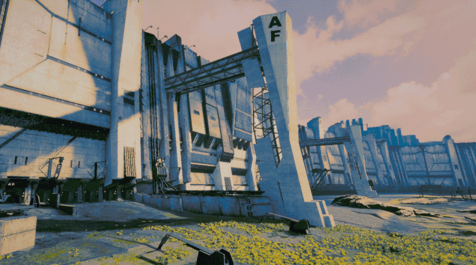

# 그래서 오늘 배우는게 뭔데?

>URP - Universal Unity Pipeline

## 1) 이점

1. 게임 그래픽이 그려지는 과정을 이해할 수 있다.

2. 1번을 이해하면 병목이 어디서 일어나는지 알 수 있다.
	1. 관점: CPU, GPU

---
## 2) 목차

1. URP를 배우는 이유
	1. 게임 그래픽스 렌더링 이해하기

2. Render Pipeline 이 무엇인가?

3. RP가 처리하는 최소 단위는?
	1. Vertex / Polygon / Mesh

4. 게임 그래픽을 구성하는 핵심 요는?
	1. Texture / UV-Mapping
	2. Material
	3. Shader

5. RP의 공통 흐름

6. Unity가 사용하는 RP 구조는?

7. Forward vs Defferd Pipeline 개념

8. Forward RP 과정
	1. CPU 명령
	2. Vertex Shader
	3. Rasterizer
	4. Pixel Shader
	5. 화면 출력

9. Unity 실제 사용해보기

---
# 그래서 오늘 목표가 뭔데?

1. 게임 그래픽이 그려지는(렌더링) 과정을 이해
2. 게임이 어디에서 병목이 일어나는지 파악할 수 있다.

해결하는건 특강(?) -> 유니티 디버깅

---
# Render Pipeline(RP)란 무엇인가?

## 게임이 화면에 그려지는  과정 (CPU -> GPU -> 화면)

## 1) 정리

> **CPU**: 이 3D 모델들을 이 카메라 시점에서 그려줘 (명령, 데이터 전달)
> **GPU**: 알겠어. 
> 1. 3D를 2D로 변환(Vertex)하고, 
> 2. 픽셀로 쪼개서(Rasterization), 
> 3. 색을 채워서(Pixel/Fragment) 
> 4. 화면에 보여줄게

## 2) GPU관점에서 RP 를 처리하는 최소 단위

### 2-1) Vertex(점)

- 3D 공간상의 **한 점**을 의미합니다. 좌표 (x, y, z)로 구성.

 

### 2-2 Polygon(면, 다각형)

- Vertex(점) 들이 모여 만들어지는 **최소의 면 단위**.

 

### 2-3 Mesh (모델)

- **메시(Mesh)**: 면(Polygon)들의 집합 = 모델

> **점(Vertex) -> 면(Polygon) -> 메시(Model)**
> GPU가 점의 위치를 우선적으로 계산.
> 그 점들을 이어서 Polygon이라는 면을 만들어서 모델을 이루고,
> 최종적으로 Pixel에 색을 채워 넣는다.

 

 

- **Mesh Filter**: 어떤 모양(Mesh)을 쓸 것인가?
- **Mesh Renderer**: 그 모양을 화면에 '그리는' 담당자. (Material 참조)
- **Material**: 어떤 **색**과 **질감**을 그릴건데?

---
# 3. 게임 그래픽을 구성하는 핵심 요소

> Texture, Material, Shader

## 3-1. Texture
+UV Mapping

### 3-1-1. UV Mapping
- 3D 표면의 위치(점/면)와 2D 텍스처의 위치(UV 좌표)를 연결하는 과정.
  2D 이미지를 3D 물체 표면에 정확히 붙이는 방법이다.

### 3-1.2 Auto Mapping Tools

### 3-2. Material

- 게임 화면에 보이는 **질감**을 담당합니다.
- 색상, 질감, 빛, 투명도 등 정보를 포함합니다.

### 3-3. Shader
- Material이 가진 Texture 혹은 색상 정보를 조합해서 화면에 최종적으로 질감을 입히는 역할!
- Shader (틀/설계도): 어떤 데이터를 담을 **빈 칸(속성)** 을 가진다

---
# 그래픽 처리 순서 (게임 엔진)

## 4가지 (거시적)
1. **CPU 명령 (Draw-Call)**
   CPU가 무엇을 그릴지 정해서 명령을 내리면,
   
2. **Vertex Shader**
   GPU가 그 물체의 **점(Vertex)** 을 화면 위치에 맞게 옮김.
   
3. **Rasterizer**
   모니터 눈금에 맞춰 **픽셀**로 쪼갬.
   
4. **Pixel/Fragment Shader**
   마지막으로 그 칸들에 색을 채운다.
   
   #### 모니터 출력

## 8가지 (미시적)

### 1) 1~3단계 (성능, 형태 잡기)
#### 1. CPU & Draw-Call

> CPU -> GPU에게 그려라! 라고 명령하는 단계
> 메시(Mesh), 머테리얼(Material)

#### 2. Vertex Shader (정점 연산)

> 3D 공간에 있는 어떤 메시/모델을 2D화면에 위치 시키는 녀석.

#### 3. Culling

> 불필요한 영역을 계산에서 지워버려.
##### 3가지
[Default로 제공]
- **프로스텀 컬링(CPU)**: 카메라 시야 아예 밖에 있어? (시야 밖 통째로 버림)
  
- **백페이스 컬링(GPU)**: 물체 면의 방향이 카메라 반대편(뒷편)을 보고 있냐? (뒷면 버림)

[직접 설정]
- **오클루전 컬링(CPU/GPU)**: 앞에 있는 물체에 완전히 가려졌는가? (가려진 놈 버려)

### 4~5단계 (비주얼 담당 = 색 칠하기)

#### 4. Rasterizer

> 출력될 **픽셀 조각**들로 쪼개는 과정임.

- 이 **계단 현상(Aliasing)** 이 발생
  추후에 **Anti-Aliasing** 개념까지 들어감.

#### 5. Pixel/Fragment Shader (색상과 질감)

- 실제 색을 입히는 단계.
- Texture하고 그림자 영역이 여기서 처리됨.

### 6~7단계

#### 6. Depth Test (Z-Test)

> 그려지는 우선순위 = 오브젝트 앞뒤 판별

- **Z-Buffer(깊이 지도)**
	- 새로 그릴 픽셀이 기록된 값보다 뒤에 있으면 계산을 취소함.

#### 7. Blending

> 배경하고 어떻게 섞일까?
> 앞뒤 판별이 끝난 후, 배경색+현재 픽셀 합성

- 불투명
- 반투명

##### Q. 불투명 객체끼리 겹쳤다면?
- Front-to-Back
- Z-Write ON

##### Q. 불투명과 투명 객체끼리 겹쳤다면?
- Back-to-Front
- Z-Write OFF

### 8단계

#### 8. Post-Processing

- **Bloom**

- Color Gradient

- Anti-Aliasing x2 x4 x8

---
## 1. RP를 이해하기위한 소스 개념 이해하기

###  RP 일련과정 이해를 위한 소스

- Vertex(점)
- Polygon(면)
- Mesh(모델)

- Texture (+UV-Mapping)
- Material
- Shader

 

### 그래픽 처리 일련 과정

- 1~8단계 **키워드 기억**하기

### Unity가 가지고 가는 RP 이해하기 (Forward)

## 1) Built-in Pipeline (Legacy)

- 개발자가 내부 구조를 수정할 수 없음
- 유니티에서 제공해주는 옵션 조정만 가능

 

## 2) SRP (Scriptable-Render-Pipeline) 
-> 기반 템플릿 **URP/HDRP**

- Built-in 한계?
- SRP 초기: C#, HLSL 언어 (2018)
- SRP 기반 템플릿 -> URP/HDRP (2019)

 

### Q. 그래서 URP 장점은?

- SRP Batcher (드로우 콜 최적화)
- Forward+
- GPU Resident Drawer

---

<-> Deffered RP

## 1) Forward Render Pipeline

- 오브젝트를 그리면서 조명을 그때그때 계산함.

## 2) Deffered Render Pipeline

- 먼저 화면에 필요한 정보들을 저장
	- 위치
	- 노멀
	- 머테리얼
